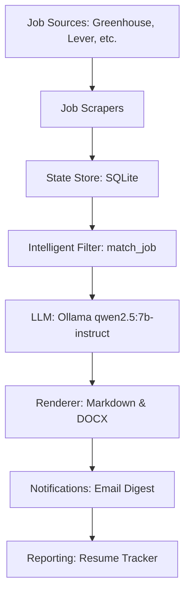

# 🤖 JobGraph: AI-Powered Career Automation
An intelligent, autonomous system designed to automate job discovery and resume personalization. Built with privacy and career success in mind, **JobGraph** leverages a **Local LLM via Ollama**, **Multi-Source Scraping**, and **Automated Document Rendering** to transform the job search process into a data-driven, high-conversion pipeline.

🏗️ **System Architecture**
The project is built on a modular Python orchestration layer. It handles multi-source job fetching, intelligent role filtering based on candidate experience, and high-fidelity document generation.



✨ **Core Features & Technical Highlights**

### 1. 🧠 100% Local LLM Inference (Zero API Costs)
Instead of relying on costly APIs like OpenAI, this project completely runs locally hosted LLMs (e.g., `qwen2.5:7b-instruct`) using **Ollama**.
*   **Benefit**: Guaranteed data privacy (your personal profile never leaves your machine) and zero recurring inference costs.

### 2. 🔍 Multi-Source & High-Efficiency Scraping
The system supports multiple ATS providers (Greenhouse, Lever, SmartRecruiters) and generic HTML pages, ensuring a broad reach across the job market.
*   **Implementation**: Utilizes `BeautifulSoup4` for lightweight, CPU-friendly parsing and a config-driven approach for easy scaling.

### 3. 🎯 Intelligent Role Filtering & Matching
To prevent waste, the agent filters jobs for roles that strictly fit the candidate's profile (e.g., < 1 year experience, specific skill sets).
*   **Benefit**: Focuses only on high-probability opportunities, avoiding 'apply-to-everything' exhaustion.

### 4. 📄 Automated Professional Rendering (DOCX/MD)
Generates high-quality, tailored resumes in both **Markdown** for quick previews and **DOCX** for submissions.
*   **Implementation**: Uses `python-docx` for precise styling and content injection, ensuring the output is recruiter-ready.

### 5. 📬 Email Digest & Automated Scheduling
Monitors the job market 24/7. It can be scheduled via Windows Task Scheduler to run at peak times (11:00 AM & 5:00 PM) and emails a summary of tailored resumes.
*   **Benefit**: The system works for you even while you sleep, delivering ready-to-use resumes directly to your inbox.

🛡️ **Tech Stack Overview**

| Category | Technology | Rationale / Usage |
| :--- | :--- | :--- |
| **Backend / Orchestration** | Python 3.11+ | Lightweight, highly extensible orchestration. |
| **Generative AI** | Ollama | Local LLM hosting for secure, cost-free tailoring. |
| **Parsing / Scraping** | BeautifulSoup4 | High-performance, ethical scraping of public job listings. |
| **Database** | SQLite | Lightweight, stateful tracking of processed jobs. |
| **Document Rendering** | python-docx | Professional DOCX generation aligned with industry standards. |
| **Email Service** | SMTP | Secure, automated delivery of resume digests. |

🛠️ **Setup & Installation Instructions**

### Prerequisites
*   **Python 3.11+**
*   **Ollama**: [Download from ollama.com](https://ollama.com/)
*   **Pull the Model**: `ollama pull qwen2.5:7b-instruct`

### 1. Clone & Install
```powershell
git clone <repository_url>
cd "resume builder"

# Create virtual environment
python -m venv .venv
.\.venv\Scripts\activate

# Install requirements
pip install -e .
```

### 2. Run Bootstrap Script
```powershell
.\scripts\bootstrap.ps1
```

### 3. Configure Your Profile
Edit the YAML files in the `configs/` directory:
*   `configs/candidate_profile.yaml`: Add your experience, skills, and projects.
*   `configs/settings.yaml`: Configure LLM, output, and email settings.
*   `configs/companies.yaml`: Enable/disable target company scrapers.

### 4. Preview & Run
To preview matches without writing files:
```powershell
python -m jobgraph.cli preview --project-root .
```
To run the full pipeline (tailor resumes, write files, send email):
```powershell
python -m jobgraph.cli run --project-root .
```

⚙️ **Scheduling (Windows)**
Register the daily schedules to run automatically:
```powershell
.\scripts\register_schedule.ps1 -Force
```

📊 **Output & Tracking**
*   **Tailored Resumes**: Located in `output\YYYY-MM-DD\`
*   **Resume Tracker**: An Excel workbook (`output\resume_tracker.xlsx`) is updated after every run.
*   **Logs**: `logs\agent.log`

🤝 **Contact**
**Akshay Raj**
[LinkedIn: www.linkedin.com/in/akshay--raj](https://www.linkedin.com/in/akshay--raj)

---
*This project was developed to demonstrate end-to-end expertise in AI engineering, automated data pipelines, and practical problem-solving for the modern career journey.*
